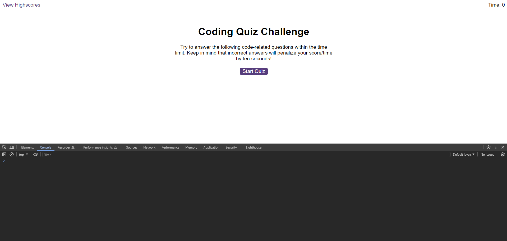
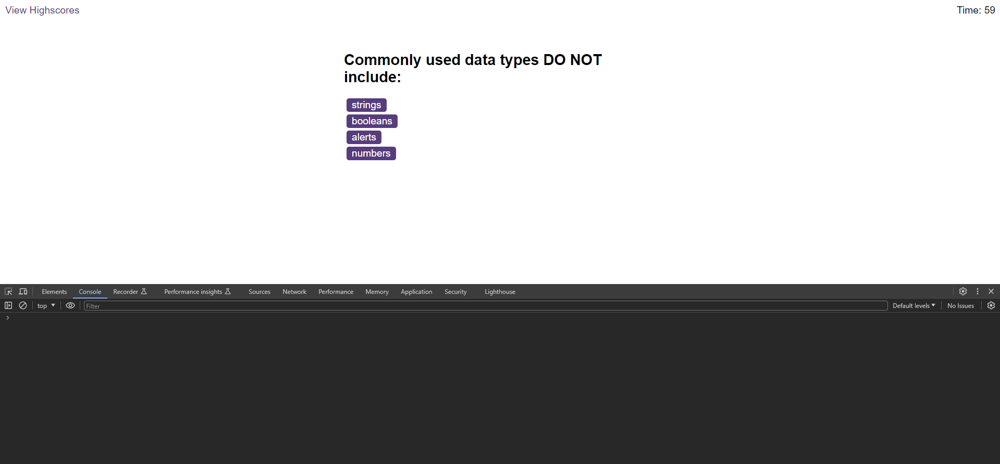
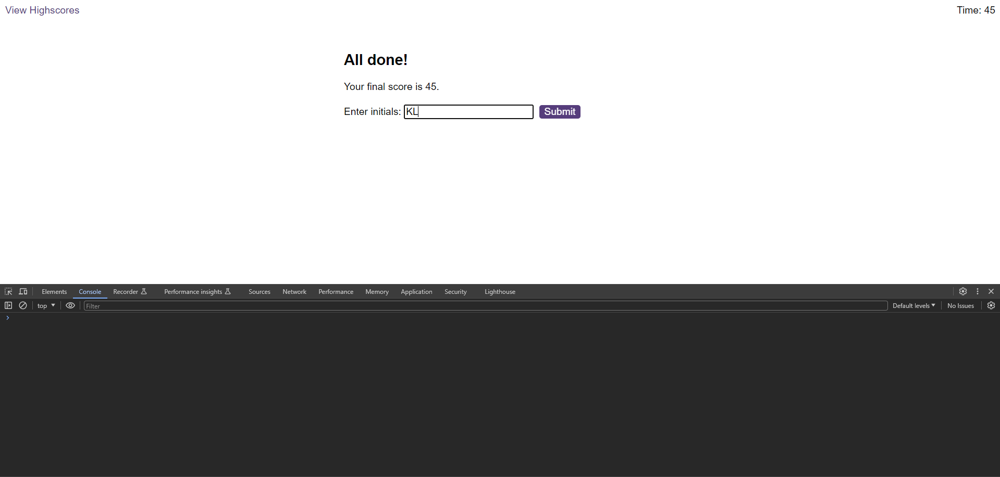
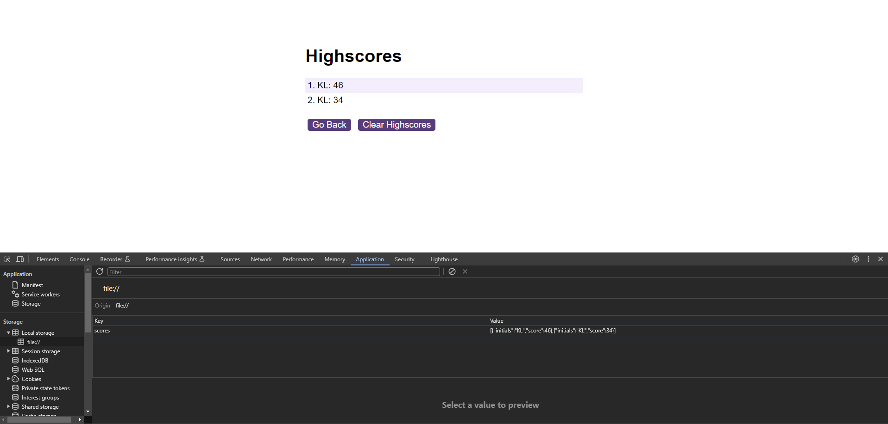

# Random-Quiz-Game-Programme

A random quiz game which keeps track of your score and timer countdown

## Description

- A quiz game that will load random question.
- It will randomly generate a question after you click on start quiz.
- You have 60 seconds to answer the alloted question.
- If you select a wrong answer it will deduct 15 seconds off your timer.
- If you select a correct answer it will play a sound and display correct at the bottom.
- If wrong answer is selected it will play a sound and display incorrect at the bottom
- You timer will become your score.
- You can add your initials at the end page.
- After you submitted your initials it will show you the highest scores and the initials belonging to those players.
- It will display with the highest score first.
- When Clear Highscores is clicked it will delete all the score records.
- Clicking Go Back will take you to the main screen where you can take the quiz again.

[GitHub page](https://github.com/Digita1Panda/random-quiz-game-programme)

[Coding Quiz Challenge](https://digita1panda.github.io/random-quiz-game-programme/)

## Installation

N/A

## Usage

## Credits

N/A

## License

MIT License

Copyright & All rights Reserved (c) 2023 Kwok Law

Permission is hereby granted, free of charge, to any person obtaining a copy of this software and associated documentation files (the “Software”), to deal in the Software without restriction, including without limitation the rights to use, copy, modify, merge, publish, distribute, sublicense, and/or sell copies of the Software, and to permit persons to whom the Software is furnished to do so, subject to the following conditions:

The above copyright notice and this permission notice shall be included in all copies or substantial portions of the Software.

THE SOFTWARE IS PROVIDED “AS IS”, WITHOUT WARRANTY OF ANY KIND, EXPRESS OR IMPLIED, INCLUDING BUT NOT LIMITED TO THE WARRANTIES OF MERCHANTABILITY, FITNESS FOR A PARTICULAR PURPOSE AND NONINFRINGEMENT. IN NO EVENT SHALL THE AUTHORS OR COPYRIGHT HOLDERS BE LIABLE FOR ANY CLAIM, DAMAGES OR OTHER LIABILITY, WHETHER IN AN ACTION OF CONTRACT, TORT OR OTHERWISE, ARISING FROM, OUT OF OR IN CONNECTION WITH THE SOFTWARE OR THE USE OR OTHER DEALINGS IN THE SOFTWARE.

---

## Badges

## Features

N/A

## Contributing

## Tests

N/A

---

Copyright © 2023 K.Law All Rights Reserved.
